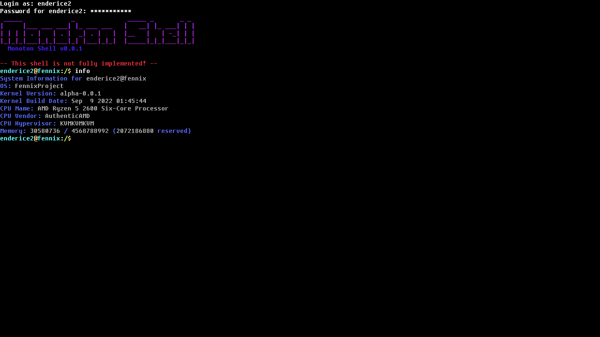

# FennixProject
##### Opeating System from scratch made in C and C++

[](https://discord.gg/AYhW6N59Wu)

[](https://www.codefactor.io/repository/github/enderice2/fennixproject)
[](https://www.codacy.com/gh/EnderIce2/FennixProject/dashboard?utm_source=github.com&amp;utm_medium=referral&amp;utm_content=EnderIce2/FennixProject&amp;utm_campaign=Badge_Grade)


[](https://wakatime.com/badge/user/29fecac7-0d8d-4232-a696-d6f5532c2c2a/project/f73f718c-1223-483f-be6a-b73c5abbe018.svg?style=for-the-badge)

---


<sub><sup>Fennix running inside QEMU</sup></sub>

#### The content

- Fennix Project
    - boot
        - Coming Soon™
    - kernel
        - The core components of the operating system.
    - libc
        - The C standard library.
    - userspace
        - The userland of the operating system.

---
##### ❗ Warning

`Before you do anything, remember that this project is in the early stages of development.`

`Most things are very unstable or broken.`

---

## 💾 Download ISO Image

- Access [Actions page](https://github.com/EnderIce2/FennixProject/actions/workflows/makefile.yml) from the GitHub page.
- Select the latest run and under "Artifacts" you will find the ISO file (it's ZIP compressed).
- Unzip it and add it to a virtual machine as CD-ROM.

---

## 🔽 Download, compile & run

- Clone this repository using

```bash
git clone --recurse-submodules https://github.com/EnderIce2/FennixProject
```

Before doing anything, you must install the following packages:

```bash
# Debian Based Systems
sudo apt-get install make gcc-mingw-w64-x86-64 gcc-mingw-w64-i686 mingw-w64 qemu qemu-kvm xorriso genisoimage ovmf nasm doxygen build-essential bison flex libgmp3-dev libmpc-dev libmpfr-dev texinfo mtools
```

And follow this [page](https://wiki.qemu.org/Hosts/Linux#:~:text=for%20both%20variants.-,Building%20QEMU%20for%20Linux,-Most%20Linux%20distributions) to install the required packages for QEMU.
If you want to use the one that comes with your distribution, go on `tools/Makefile` and remove `do_qemu` at line 11 (starts with `all:`) and update `QEMU_PATH` variable inside `Makefile.conf`.

- Go to the local repository and run the following command

```bash
make tools
```

This command will download all the required files to compile the operating system.

After that, you should be able to compile the operating system.

- Currently it was tested **only** on **Ubuntu 20.04** and **Ubuntu 22.04**. I don't guarantee that it will work on other distributions or older versions of Ubuntu.

---

- To run the OS:

```bash
make run
```
<sub><sup>or `make build` to build it without running.</sup></sub>

- To cleanup the code:

```bash
make clean
```
